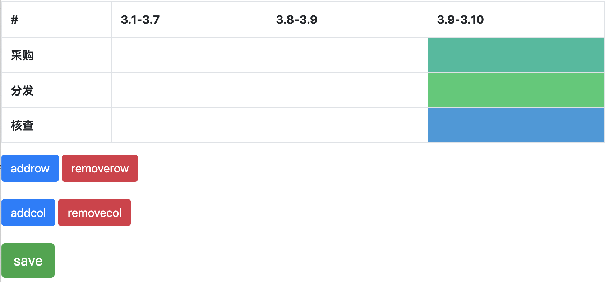
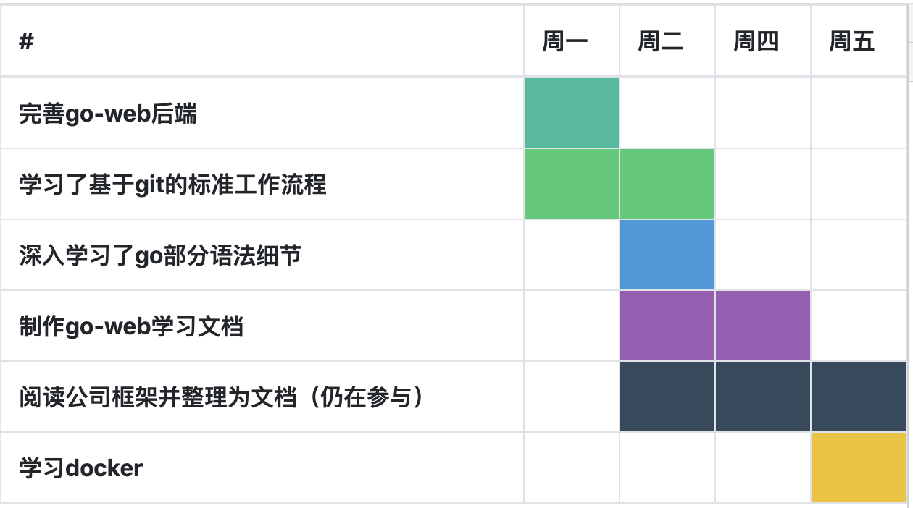

# GanMaker

点击访问[在线版](https://zgarry.github.io/GanMaker/%E5%89%8D%E7%AB%AF/)

GanMaker是一个基于网页版的**简易**甘特图制造器。

[甘特图](https://baike.baidu.com/item/%E7%94%98%E7%89%B9%E5%9B%BE/113232)是一种强有力的日程安排手段。

## 简介

ganMaker页面目前是这样的：

这是我自己创建的一个日程总结。（给领导看的那种）

## 优劣与使用场景

很多项目管理软件都支持了甘特图，我究竟是挑选那选重量级软件，还是ganMaker呢？

下面是一个列表：

| #        | ganMaker                      | 大型项目管理软件                   |
| -------- | ----------------------------- | ---------------------------------- |
| 优点     | 简单，快速                    | 时间控制跟紧缺，有的还可以分配任务 |
| 适用场景 | 个人报告，ppt中，主要用来展示 | 实际项目中，主要用来供内部控制进度 |

## 项目架构

ganMaker **v0.5**

整体框架：BOOTSTAP+VUE，数据改变后，调用刷新函数来达成数据和显示的绑定。workdoc里有项目的工作日志。
